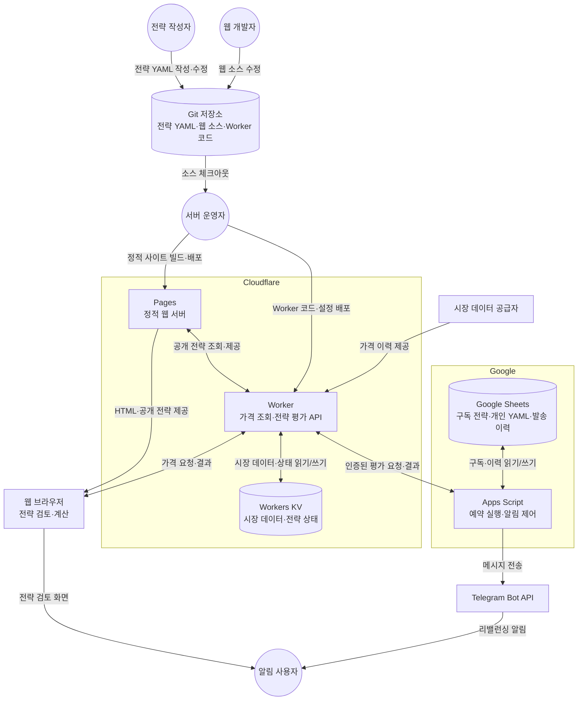

# Investment Strategy

YAML로 정의한 자산배분 전략을 브라우저에서 검토하고, Google Apps Script와
Cloudflare Worker를 이용해 리밸런싱 알림을 받는 프로젝트입니다.

백테스트 결과는 전략 연구를 위한 자료이며 투자 권유가 아닙니다. 과거 성과는 미래
성과를 보장하지 않습니다.

## 사용 흐름

1. 정적 웹페이지에서 기본 전략을 검토하거나 YAML 전략 파일을 가져옵니다.
2. 개인 전략은 브라우저에서 검토한 뒤 Google 스프레드시트의 `개인 전략` 탭에 등록합니다.
3. Apps Script가 Cloudflare Worker에 평가를 요청합니다.
4. Worker는 최근 시장 데이터와 저장된 전략 상태로 리밸런싱 필요 여부를 계산합니다.
5. Apps Script가 필요한 경우에만 Telegram 메시지를 보냅니다.

## 시스템 구성도



원은 사람의 역할, 사각형은 실행되는 서버·시스템, 원통은 데이터를 보관하는 저장소를 뜻하며
동작과 데이터 이동은 화살표에 표시합니다. Pages와 Worker는 별도의 배포 대상입니다.
브라우저는 Pages에서 화면과 공개 전략을 받고
Worker에서 가격을 조회합니다. 자동 알림은 Google Apps Script가 Worker에 평가를 요청한 뒤
그 결과를 Telegram으로 전달하는 경로로 동작합니다. 개인 전략 YAML은 공개 Pages에 올리지
않고 사용자의 브라우저와 Google Sheet에서만 관리합니다.

웹페이지에서의 전략 계산은 사용자의 브라우저에서 이뤄집니다. 자동 알림 평가만
Cloudflare Worker에서 수행합니다.

## 주요 구성

```text
strategies/       기본 YAML 전략
src/web/          정적 웹페이지 소스
dist/web/         배포용 정적 웹 산출물
data-proxy/       가격 프록시 및 알림 평가 Cloudflare Worker
docs/             전략 DSL, 운영 및 사용자 안내
```

## 역할별 문서

| 독자 | 먼저 볼 문서 | 다음 문서 |
|---|---|---|
| 전략 작성자 | [YAML 전략 안내](docs/strategy.md) | [전략 DSL](docs/strategy-dsl.md), [전략 비교 검증 기준](docs/validation-protocol.md) |
| 서버 운영자 | [Cloudflare 데이터 프록시 및 배포](docs/data-proxy.md) | [전략 목록 노출 설정](docs/strategy-visibility.md) |
| 알림 설정 사용자 | [전략 사용자용 전략 검토 및 알림 안내](docs/strategy-user-guide.md) | [Google Sheets 리밸런싱 알림 설정](docs/google-apps-script/README.md) |
| 전략 연구자 | [전략 연구 결정 기록](docs/research/README.md) | [전략 비교 검증 기준](docs/validation-protocol.md) |
